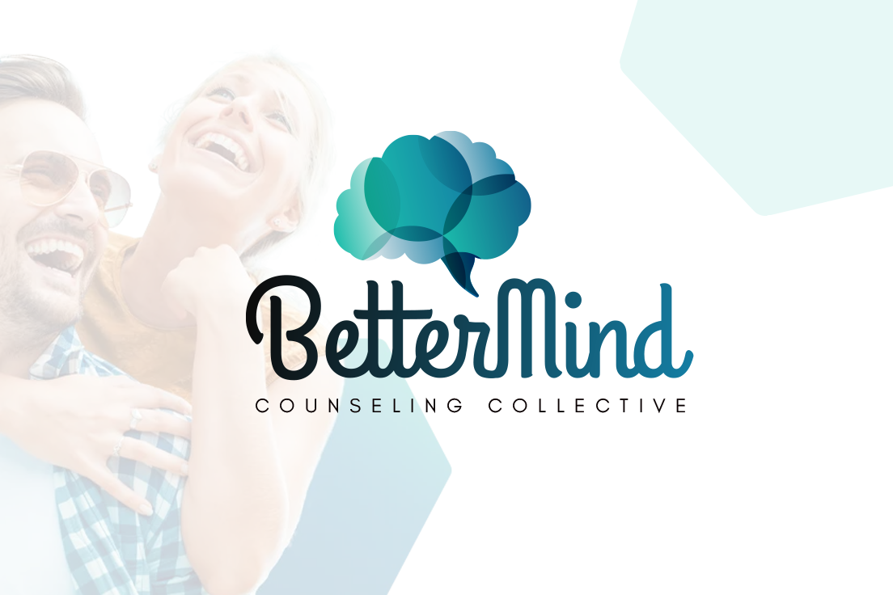
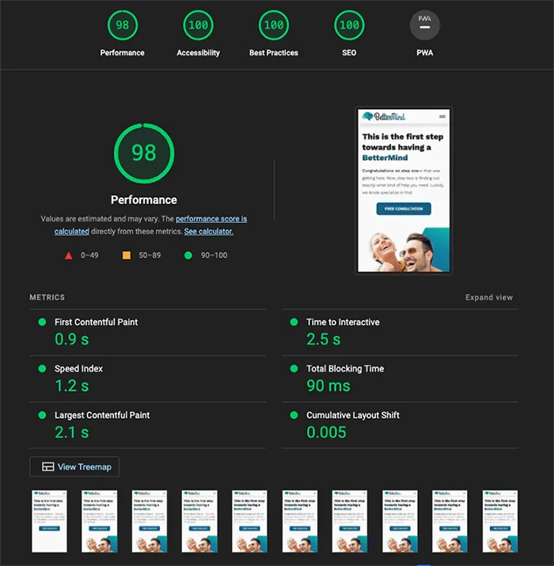

# View the [live site here](https://better-mind.vercel.app)!

# A bit About the project

## My first NextJS site

First and foremost, I learned a LOT from this project. As my first NextJS project, got to see the nuances of the framework, its limitations, and of course its strengths.

## Hindsight is 20/20

Looking back, I can see a lot of ways to improve upon what I built here to save time, increase scalabity, and optimize performance. Over time I'm hoping to come back and refactor some of the problem spots and see if I cant continuously make it better as I learn more.

## From a design perspective

Looking at it from the eyes of a designer, I'm pretty pleased how it turned out. The brand feels strong, modern, and yet relaxed and the logo is responsive and multifaceted. If I was to adjust anything in the design it would probably be the light blue color. I feel it can use minor adjustments.

## Lighthouse

 

## Learn more about Nextjs

To learn more about Next.js, take a look at the following resources:

- [Next.js Documentation](https://nextjs.org/docs) - learn about Next.js features and API.
- [Learn Next.js](https://nextjs.org/learn) - an interactive Next.js tutorial.

You can check out [the Next.js GitHub repository](https://github.com/vercel/next.js/) - your feedback and contributions are welcome!
